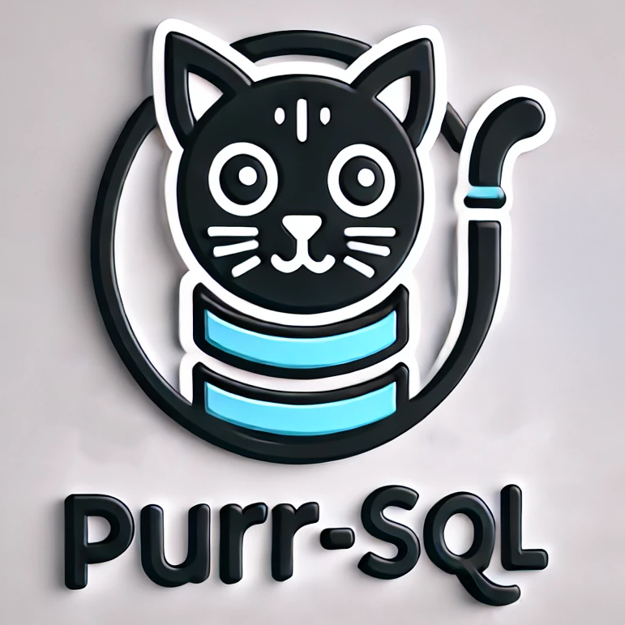

# PurrSQL

The best plugin for purr-fect SQL queries. Using this plugin, you can use Cheshire Cat to query and manage a database.

## Usage

1. Install the plugin
2. Go to settings and set the DB connection url _(or use the default one as an example)_
3. Use the cat to make queries

### TODOs and progress

To view current progress and todos, go to the [project page](https://github.com/users/MatteoGheza/projects/2).

### Warning

This plugin is still in development and may not work as expected. Use at your own risk.
